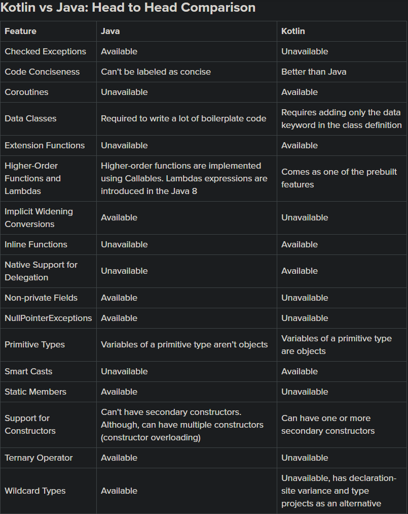

Kotlin is a statically typed language developed by JetBrains. Similar to Java, Kotlin has become a top choice for developing Android applications. This is evident from the fact that Android Studio comes with inbuilt support for Kotlin like it has for Java.

#Kotlin vs Java
So, the question is whether one should switch to Kotlin from Java or not? Well, it depends on preferences. However, before making the switch it’s important to understand the distinction between the two programming languages.

###Checked Exceptions
One major difference between Java and Kotlin is that the latter has no provision for checked exceptions. Therefore, there is no need to catch or declare any exceptions.

If a developer working in Java finds it infuriating to use try/catch blocks in the code then the omission made by Kotlin can be considered a welcome change. However, it’s the opposite if the developer believes that checked exceptions encourage error recovery and the creation of robust code.

###Code Conciseness
Comparing a Java class with an equivalent Kotlin class demonstrates the conciseness of Kotlin code. For performing the same operation that the Java class does, a Kotlin class necessitates for less code.

For example, a particular segment where Kotlin can significantly reduce the total amount of boilerplate code is findViewByIds.

Kotlin Android Extensions permit importing a reference to a View into the Activity file. This allows for working with that View as if it was part of the Activity.

###Coroutines
CPU-intensive work and network I/O are long-running operations. The calling thread is blocked until the whole operation completes. As Android is single-threaded by default, an app’s UI gets completely frozen as soon as the main thread is blocked.

The traditional solution for the problem in Java is to create a background thread for the long-running or intensive work. However, managing multiple threads leads to an increase in the complexity as well as errors in the code.

Kotlin also allows the creation of additional threads. However, there is a better way of managing intensive operations in Kotlin, known as coroutines. Coroutines are stackless, which means they demand lower memory usage as compared to threads.

Coroutines are able to perform long-running and intensive tasks by suspending execution without blocking the thread and then resuming the execution at some later time. It allows the creation of non-blocking asynchronous code that appears to be synchronous.

The code using coroutines is not only clear but concise too. Moreover, coroutines allow for creating elegant additional styles of asynchronous non-block programming such as async/await.

###Data Classes
Full-size projects have several classes that are solely meant to hold data. Though these classes have very little to no functionality, a developer needs to write a lot of boilerplate code in Java.

Usually, a developer needs to define a constructor, several fields to store the data, getter and setter functions for each of the fields, and equals(), hashCode(), and toString() functions.

Kotlin has a very simple way of creating such classes. The developer needs to only include the data keyword in the class definition, and voila! The compiler will take care of the entire task on its own.

###Extension Functions
Kotlin allows developers to extend a class with new functionality via extension functions. These functions, although available in other programming languages like C#, aren’t available in Java.

Creating an extension function is easy in Kotlin. It is done by prefixing the name of the class that needs to be extended to the name of the function being created. In order to call the function on the instances of the extended class, one needs to use the ‘.’ notation.

###Higher-Order Functions and Lambdas
A higher-order function is one that takes functions as parameters or returns a function. Also, Kotlin functions are first-class. This means that they can be stored in data structures and variables, which can be passed as arguments to and returned from other higher-order functions.

The whole thing simply means that functions can be operated in all the ways that are possible for other non-function values.

As a statically typed programming language, Kotlin makes use of a range of function types for representing functions. Moreover, it comes with a set of specialized language constructs, such as the lambda expressions.

Anonymous functions and lambda expressions are also known as function literals. These are functions not declared but passed immediately as an expression.

###Implicit Widening Conversions
There is no support for implicit widening conversions for numbers in Kotlin. So, smaller types aren’t able to get converted to bigger types. Whereas Java has support for implicit conversions, Kotlin requires to perform an explicit conversion in order to achieve the conversion.

###Inline Functions
Variables that are accessed in the body of the function are known as closures. Making use of higher-order functions can impose several runtime penalties. Every function in Kotlin is an object and it captures a closure.

Both classes and function objects call for memory allocations. These along with virtual calls introduce runtime overhead. Such an additional overhead can be avoided by inlining the lambda expressions in Kotlin. One such example is the lock() function.

Unlike Kotlin, Java doesn’t provide support for inline functions. Nonetheless, the Java compiler is capable of performing inlining using the final method. This is so because final methods cannot be overridden by sub-classes. Also, call to a final method is resolved at compile time.

###Native Support for Delegation
In programming terminology, Delegation represents the process where a receiving object delegates operations to a second delegate object. Kotlin supports composition over inheritance design pattern by means of the first-class delegation, also known as implicit delegation.

Class delegation is an alternative to inheritance in Kotlin. This makes it possible to use multiple inheritances. Also, Kotlin’s delegated properties prevent the duplication of code.

###Non-private Fields
Encapsulation is essential in any program for achieving a desirable level of maintainability.

By means of encapsulating the representation of an object, it can be enforced how callers interact with it. Moreover, it is possible to change the representation without the need to modify callers, provided the public API remains unchanged.

Non-private fields or public fields in Java are useful in scenarios where the callers of an object need to change accordingly to its representation. It simply means that such fields expose the representation of an object to the callers. Kotlin doesn’t have non-private fields.

###Null Safety
One of the most infuriating issues concerning Java for developers is the NullPointerExceptions. Java lets developers assign a null value to any variable. However, if they try to use an object reference that has a null value, there comes the NullPointerException!

Unlike Java, all types are non-nullable in Kotlin by default. If developers try to assign or return null in the Kotlin code, it’ll fail at compile time. However, there’s a way around. In order to assign a null value to a variable in Kotlin, it is required to explicitly mark that variable as nullable. This is done by adding a question mark after the type, for example:

val number: Int? = null

Thus, there are no NullPointerExceptions in Kotlin. If you do encounter such an exception in Kotlin then it is most likely that either you explicitly assigned a null value or it is due to some external Java code.

###Primitive Types
There are 8 primitive data types, including char, double, float, and int. Unlike Kotlin, variables of a primitive type aren’t objects in Java. This means that they aren’t an object instantiated from a class or a struct.

###Smart Casts
Before an object can be cast in Java, it is mandatory to check type. This is also true in scenarios where it’s obvious to cast the object.

Unlike Java, Kotlin comes with the smart casts feature, which automatically handles such redundant casts. You don’t need to cast inside a statement provided it is already checked with the ‘is operator’ in Kotlin.

###Static Members
Kotlin has no provision for static members. However, in Java programming language the keyword static reflects that the particular member with which the keyword is used belongs to a type itself instead to an instance of that type.

It simply means that one and only one instance of that static member is created and shared across all instances of the class.

###Support for Constructors
A Kotlin class, unlike a Java class, can have one or more secondary constructors in addition to a primary constructor. This is done by including these secondary constructors in the class declaration.

###Ternary Operator
Unlike Kotlin, Java has a ternary operator. The Java ternary operator simply works like a basic if statement. It consists of a condition that evaluates to true or false.

Moreover, the Java ternary operator has two values. Only one of them is returned depending on whether the condition is true or false. The syntax for the Java ternary operator is:

(condition) ? (value1) : (value 2)

###Wildcard Types
In generic code, ‘?’ represents an unknown type. It is known as the wildcard. There are several uses of a wildcard, including as the type of a field, local variable, or parameter.

While Java’s type system offers wildcard types, Kotlin doesn’t. However, it has two different things; declaration-site variance and type projections as an alternative to wildcard types.

